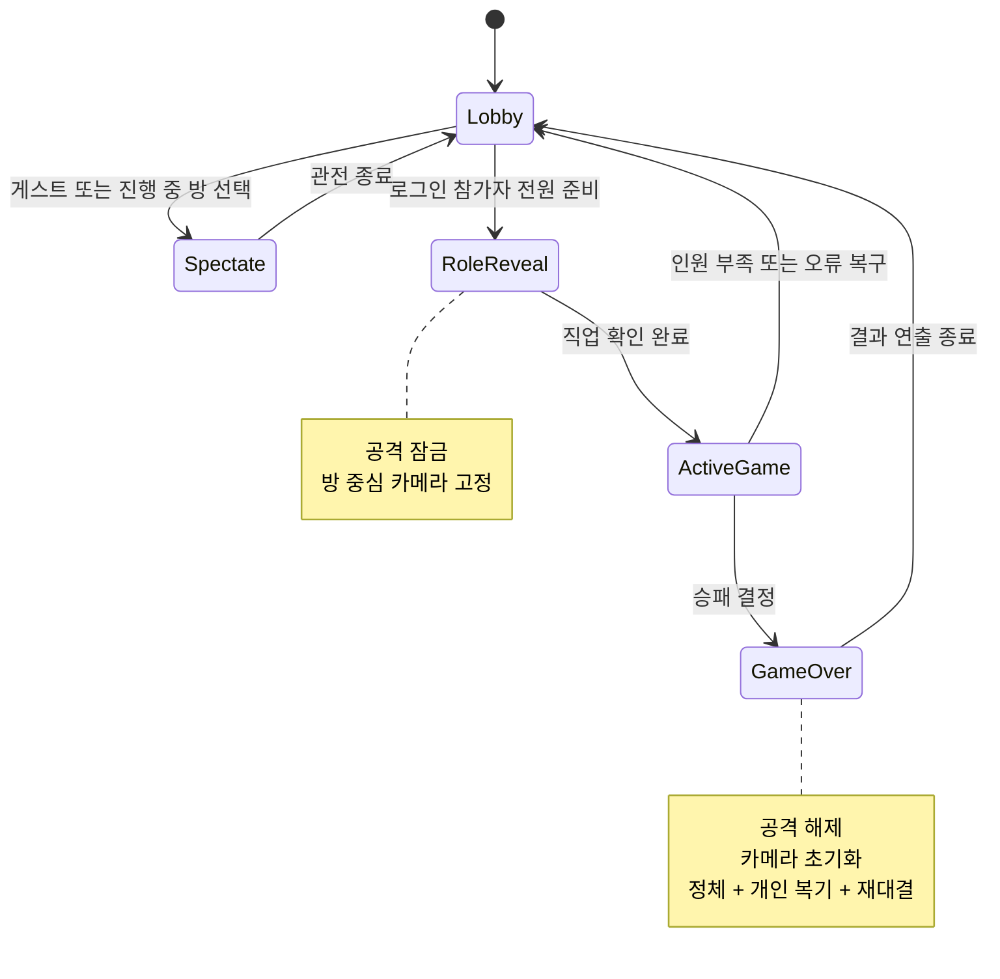

# FTUE 및 플레이어 여정 설계

## 안내 원칙

설명은 플레이 전에 몰아서 보여 주지 않고 행동 직전의 기존 화면에 붙인다.

- 로비: 목표, 낮/밤 흐름, 참가 방법, 접속자 수
- 첫 방 입장: 4장 체크리스트
- 관전: 현재 단계와 남은 시간, 게임 방법, 관전 종료
- 게임 결과: 정체 공개, 개인 복기, 한 판 더 현황

안내는 핵심 행동을 대신하지 않는다. 별도 NPC, 카메라 투어, 강제 미션은 추리 게임의 시작 속도를 늦추므로 제외했다.

## 책임 경계

| 책임 | 위치 | 이유 |
| --- | --- | --- |
| 게스트 번호와 이름 강제 | `GuestIdentity` | 접속/이름 변경/관전 정책에서 같은 규칙 재사용 |
| FTUE 이벤트 중복 방지와 전송 | `FtueAnalytics` | 게임 규칙에서 개인정보와 네트워크 세부사항 분리 |
| 운영 지표 HTTP 전송 | `LiveMetrics` | CCU와 FTUE가 같은 엔드포인트 계약을 공유 |
| 개인 복기 저장/표시 | `MatchRecap` + `Seat` | 행동 주체의 좌석에만 기록해 비밀정보 교차 노출 방지 |
| 카메라 상태 | `Screen` | 단계 연출, 재접속, 종료 복구를 한 경계에서 처리 |
| 공격 잠금 | `GameFlow`/`Stage`/`Outcome`/`Lobby` | 시작, 재접속, 종료, 관전의 실제 수명주기에 맞춰 복구 |

## 개인정보 보호 계측

FTUE 이벤트는 아래 단계만 전송한다.

1. `guide_opened`
2. `guide_completed`
3. `room_joined`
4. `first_game_started`
5. `first_night_action_completed`
6. `first_vote_completed`
7. `first_game_finished`
8. `rematch_selected`
9. `second_game_started`

각 이벤트는 플레이어 저장소의 비트 플래그로 한 번만 기록한다. 전송용 `eventId`는 이벤트마다 새로 만들어 서로 연결할 수 없게 했고, 사용자 ID·닉네임·직업·행동 대상·채팅 내용은 보내지 않는다. 기존 전적이 있는 사용자는 신규 퍼널 대상에서 제외한다.

## 수명주기

관전자는 진행 중인 판에 들어올 때 같은 카메라/공격 제한을 적용받고, 관전 종료 또는 게임 종료 시 즉시 원상복구한다. 재접속자는 방의 현재 단계에서 화면, 외형, 공격, 카메라를 다시 계산한다.
